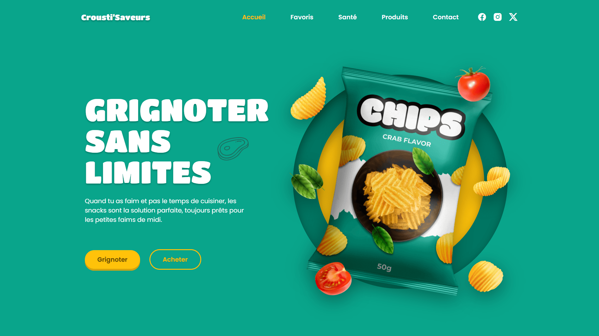

<div align="center">  
    <a href="https://chips-shop-vm.netlify.app/" target="_blank">  
        
    </a>
    </br>  
    </br>  
  <h3 align="center">🥔 Crousti’Saveurs &nbsp; — &nbsp; Boutique de Chips</h3>  
</div>

## <br /> 📌 Sommaire

&nbsp;&nbsp;&nbsp; 🎨 &nbsp; [**Introduction**](#introduction)<br />
&nbsp;&nbsp;&nbsp; 🛠️ &nbsp; [**Technologies**](#technologies)<br />
&nbsp;&nbsp;&nbsp; 🎯 &nbsp; [**Fonctionnalités**](#fonctionnalités)<br />
&nbsp;&nbsp;&nbsp; 🚀 &nbsp; [**Installation**](#installation)<br />

## <br /> <a name="introduction">🎨 Introduction</a>

Crousti’Saveurs est une landing page colorée et responsive pour une boutique de chips artisanales. Elle propose une navigation fluide, un design vibrant, un catalogue animé et une approche santé. Le site inclut une présentation produit, des valeurs nutritionnelles, un slider de favoris via Swiper.js et une section contact. Parfait pour un projet food e-commerce fun et gourmand.

## <br /> <a name="technologies">🛠️ Technologies</a>

- HTML5 sémantique et structuration claire
- CSS3 moderne avec variables, media queries et animations
- JavaScript ES6 clair et modulaire
- [Swiper.js](https://swiperjs.com/) pour les carrousels favoris
- [ScrollReveal](https://scrollrevealjs.org/) pour des animations au scroll
- [Remix Icons](https://remixicon.com/) pour des icônes vectorielles modernes
- Responsive Design pensé en mobile-first

## <br /> <a name="fonctionnalités">🎯 Fonctionnalités</a>

- Section Accueil dynamique avec éléments flottants
- Slider de chips favorites animé avec Swiper.js
- Présentation des engagements santé de la marque
- Catalogue produits avec images, titres, prix et bouton d’ajout
- Menu responsive avec effet burger animé
- Section contact complète : réseaux sociaux, téléphone, adresse
- Scroll animations : entrées, effets, survols, transitions douces
- Bouton de retour à l'accueil animé
- Thème coloré, joyeux et parfaitement responsive
- Code propre, maintenable, sans framework externe lourd

## <br /> <a name="installation">🚀 Installation</a>

### ✅ Prérequis

- [Google Chrome](https://www.google.com/) &nbsp;—&nbsp; Navigateur moderne
- [Visual Studio Code](https://code.visualstudio.com/) &nbsp;—&nbsp; Éditeur de code
- [Live Server](https://marketplace.visualstudio.com/items?itemName=ritwickdey.LiveServer) &nbsp;—&nbsp; Extension VS Code

### 📥 Cloner le projet

```bash
git clone git@github.com:ValentinMadiot/chips-shop_ui
cd chips-shop_ui
```

### ▶️ Lancer le projet

Il suffit d’ouvrir le fichier `index.html` dans un navigateur, ou d’utiliser l’extension **Live Server** sur VS Code pour un aperçu dynamique.
